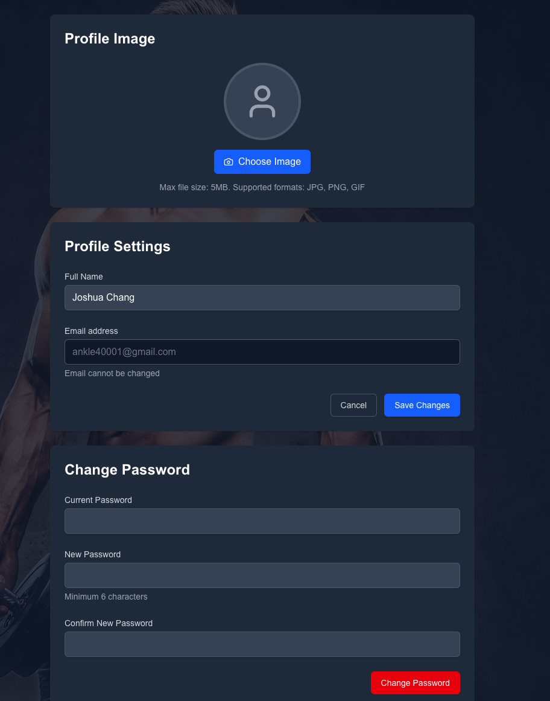
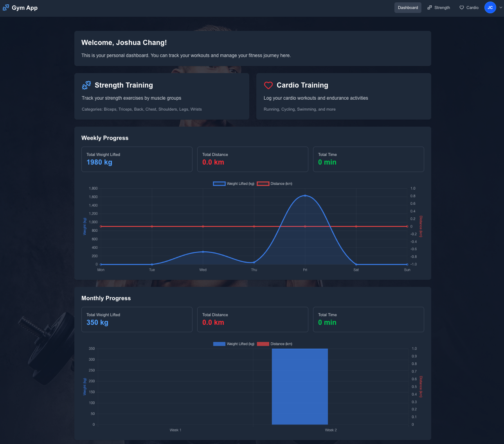
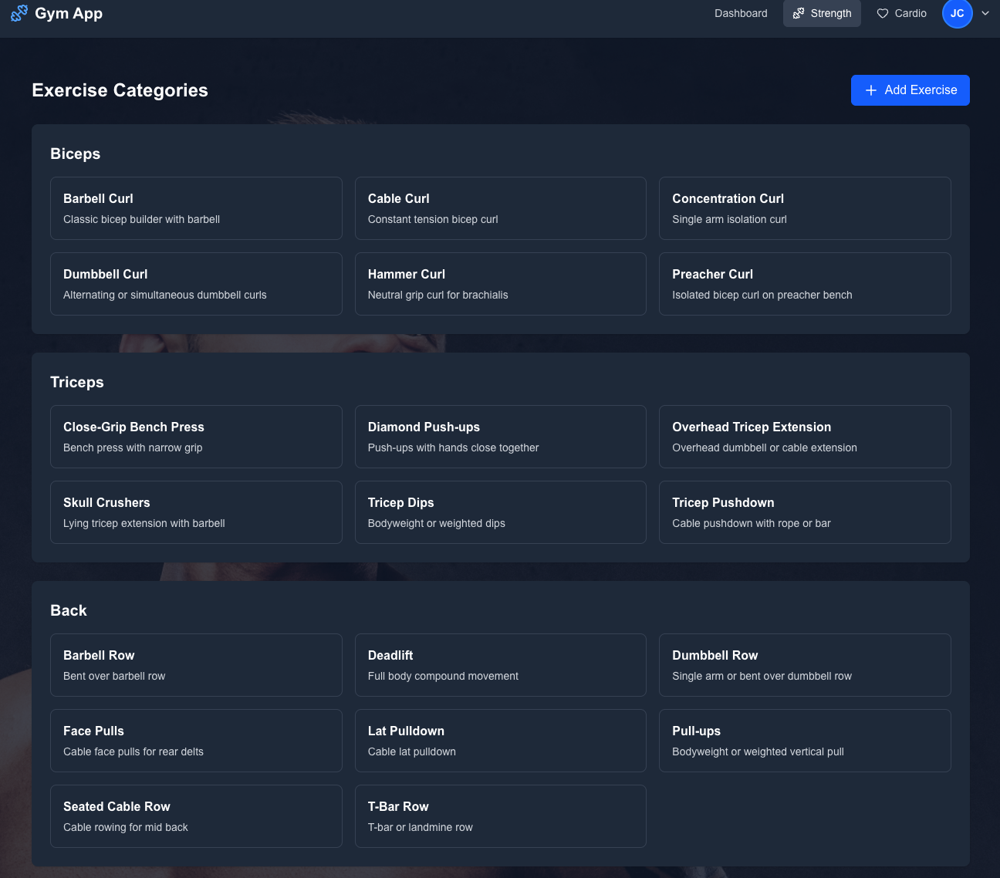
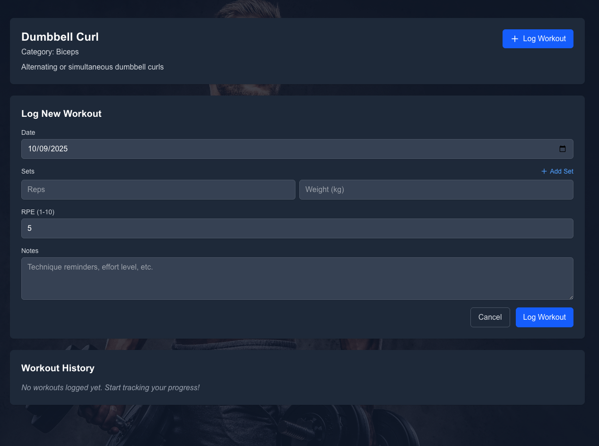
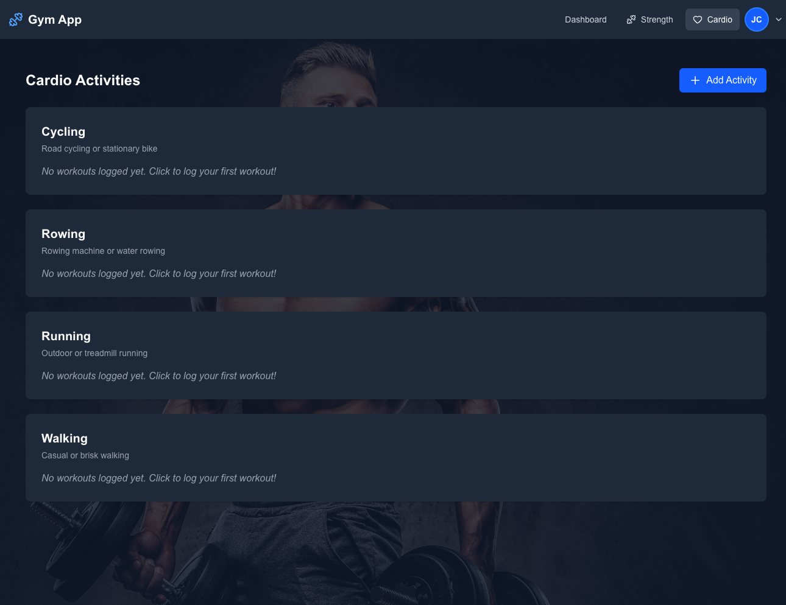
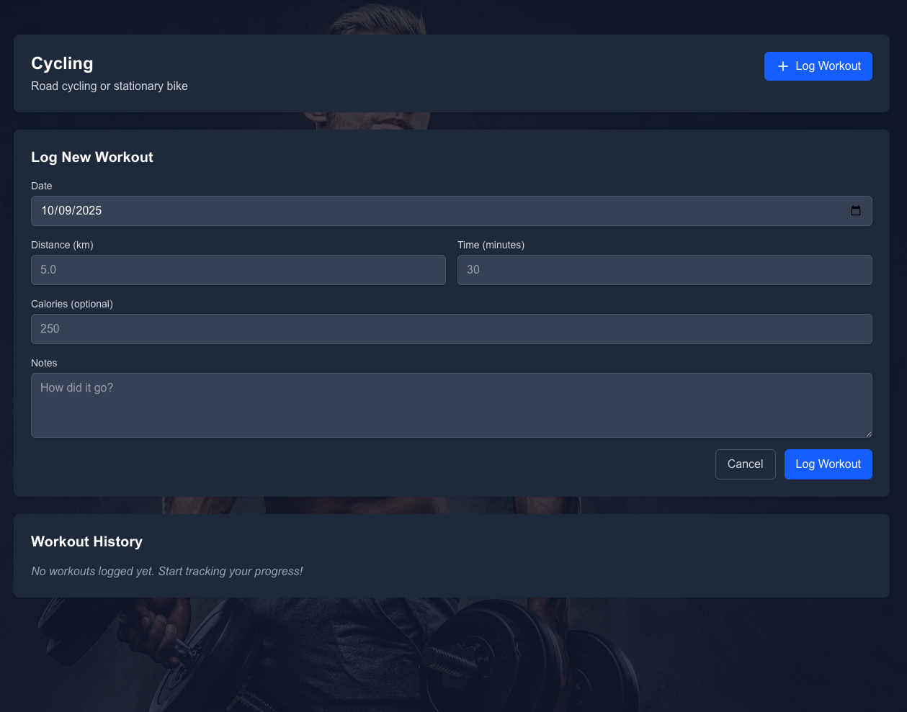

# Workout-App-Tracker

Built a personalized workout tracker used to track gym progress during Summer 2025. Currently deploying it on AWS to strengthen cloud development skills.

## 🛠 Tech Stack
- Frontend: Next.js, TypeScript, TailwindCSS  
- Backend: Express.js, MongoDB  
- Deployment: AWS  

---

## 🔐 Login / Sign Up

---

## 🎯 Personalization

---

## 📊 Dashboard

---

## 💪 Strength Training

---

## 🏃 Cardio Tracking

